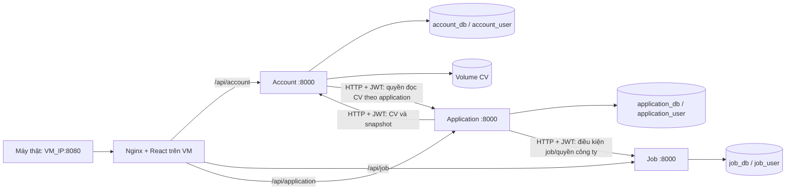

# JobApply

Ứng dụng tuyển dụng tiếng Việt cho đồ án cá nhân trong mạng nội bộ. React + JavaScript/Vite ở frontend; ba microservice Python/FastAPI; PostgreSQL, SQLAlchemy và Alembic; CV lưu trong Docker volume. Tất cả màn hình dùng API thật.

**Môi trường:** máy VS Code viết code/Git và chạy lint/test/build bằng runtime có sẵn; **VM Linux VMware chạy toàn bộ Docker Compose**. Máy thật truy cập `http://<VM_IP>:8080`. Không yêu cầu cài/chạy Docker trên máy VS Code. Hướng dẫn đầy đủ: [Triển khai và cập nhật VM](docs/deploy-vm.md).

## Khởi động nhanh

Cần Git, Docker Engine đang chạy, Docker Compose plugin v2.20+ và curl **trên VM Linux**; khoảng 3 GB RAM trống. VM host không cần cài Python/Node. Clone `https://github.com/nguyenkdy/JobApply.git` và checkout branch `main` theo [tài liệu VM](docs/deploy-vm.md).

Chuẩn bị `.env` **một lần trên VM**, không tạo/commit secrets trên máy VS Code:

```sh
cp .env.example .env
chmod 600 .env
nano .env
```

Thay 5 placeholder mật khẩu/secret bằng chuỗi ngẫu nhiên, `JWT_SECRET` tối thiểu 32 ký tự. Mật khẩu database trong URL dùng chữ/số để tránh ký tự phải URL-encode. Giữ `APP_BIND_ADDRESS=0.0.0.0`, `APP_PORT=8080` để truy cập IP VM và giới hạn nguồn bằng firewall. Hoặc nếu VM có Python, chạy `python3 scripts/configure.py` thay bước copy để tạo `.env` ngẫu nhiên; script không ghi đè file cũ.

```sh
sh scripts/deploy-vm.sh first
docker compose --profile tools run --build --rm seed
sh scripts/smoke-vm.sh http://<VM_IP>:8080
```

Mở **http://<VM_IP>:8080** từ máy thật. Lần đầu cần tải image và build dependency. Script build, đợi PostgreSQL healthy, chạy migration rồi khởi động app. `docker compose up --build` cũng được hỗ trợ: entrypoint mỗi API tự chạy migration. **Seed là lệnh riêng**, không chạy tự động trong `up` hoặc cập nhật. Xem tài liệu VM về Bridged/NAT, port forwarding và firewall.

| Vai trò | Email | Mật khẩu |
|---|---|---|
| Ứng viên | candidate@example.com | DemoJobApply123! |
| Nhà tuyển dụng NovaTech | recruiter@example.com | DemoJobApply123! |
| Nhà tuyển dụng Pixel Studio | studio@example.com | DemoJobApply123! |
| Nhà tuyển dụng GreenData | data@example.com | DemoJobApply123! |

**Các tài khoản trên và CV mẫu chỉ dùng demo local**, không phải người hoặc công ty có thật. Seed tạo 8 việc làm ở 3 công ty, 3 địa điểm, nhiều cấp bậc/hình thức. CV demo là PDF giả một trang trống với metadata, không chứa dữ liệu cá nhân. Hạn job được đặt 60 ngày sau lần seed đầu tiên.

## Kiến trúc



Một PostgreSQL container, ba database và ba user riêng; quyền CONNECT mặc định bị thu hồi. Không có truy vấn/join liên database. `shared/` chỉ chứa hạ tầng xác thực, HTTP và tạo session; mỗi service có models, nghiệp vụ, Dockerfile, dependency lock và migration riêng.

| Service | Database/bảng | API chính (sau `/api/{service}`) |
|---|---|---|
| Account | account_db: users, cvs | `POST /auth/register`, `POST /auth/login`, `GET/PUT /me`, `GET/POST /cvs`, `GET /cvs/{id}/snapshot`, `GET /cvs/{id}/download` |
| Job | job_db: companies, jobs | `GET /companies/mine`, `POST /companies`, `PUT /companies/{id}`, `GET/POST /jobs`, `GET /jobs/mine`, `GET/PUT /jobs/{id}`, `PATCH /jobs/{id}/status`, `GET /jobs/{id}/manage`, `GET /jobs/{id}/eligibility` |
| Application | application_db: applications, history | `GET/POST /applications`, `GET /applications/{id}`, `PATCH /applications/{id}/status`, `GET /applications/{id}/cv-access` |

Swagger khi chạy Compose: `http://<VM_IP>:8080/api/account/docs`, `/api/job/docs`, `/api/application/docs`. Health: `/api/account/health`, `/api/job/health`, `/api/application/health` và `/health` của gateway. Trong Swagger, đăng nhập qua `/auth/login`, sau đó nhập `access_token` vào Authorize.

Browser chỉ dùng URL tương đối `/api/...`. Địa chỉ `http://account:8000`, `http://job:8000`, `http://application:8000` dành riêng cho network Docker, không trả cho browser. PostgreSQL và backend không publish port ra host trong cấu hình mặc định. Chỉ gateway publish cổng `8080`, bind theo `APP_BIND_ADDRESS` (mặc định `0.0.0.0`) để máy thật truy cập VM. JWT dùng Bearer header, không cookie hoặc redirect phụ thuộc localhost; HTTP qua IP nội bộ hoạt động trong môi trường demo local.

## Luồng và bảo vệ dữ liệu

- Đăng ký chọn Candidate/Recruiter; mật khẩu hash Argon2. JWT HS256 kiểm tra chữ ký, `sub`, `role`, `iat`, `exp`, issuer và audience, mặc định hết hạn sau 120 phút. Mọi service dùng chung secret trong môi trường local đáng tin cậy. Không dùng header `X-User-Id`/`X-Role` để xác thực.
- MVP: mỗi recruiter sở hữu tối đa một công ty, chưa mời thành viên. Công ty được gắn với danh tính đã xác thực khi tạo. API tạo job không nhận `company_id`; server tự lấy công ty của recruiter. Chỉ sửa job Draft, đăng Draft → Published, đóng Published → Closed, không mở lại trong MVP.
- Chỉ Published và chưa hết hạn được tìm kiếm/ứng tuyển. API chi tiết vẫn cho xem job Closed hoặc hết hạn, nhưng Draft không công khai. Bộ lọc gồm từ khóa, địa điểm, cấp bậc, hình thức; tìm kiếm phân trang 12 tin trên giao diện.
- Application chỉ lấy candidate ID từ JWT. Khi nộp: Application gọi Job kiểm tra điều kiện; gọi Account kiểm tra CV thuộc ứng viên; lưu snapshot job, công ty, ứng viên và metadata CV; sau đó mới commit application và lịch sử ban đầu cùng transaction. Dependency timeout/5xx trả 503, không báo thành công.
- Unique constraint `(candidate_id, job_id)` chặn ứng tuyển trùng, kể cả request đồng thời và sau khi đã rút. Chuyển trạng thái dùng UPDATE có điều kiện trạng thái cũ, kiểm tra rowcount và commit lịch sử cùng transaction để ngăn mất cập nhật.
- Recruiter: Submitted → Reviewing/Rejected; Reviewing → Interview/Rejected; Interview → Offered/Rejected. Candidate rút từ Submitted/Reviewing/Interview. Offered, Rejected, Withdrawn là kết thúc. Lịch sử lưu actor ID/vai trò, trạng thái cũ/mới và UTC; browser hiển thị theo múi giờ máy người dùng.
- CV nhận PDF tối đa 5 MB, kiểm tra MIME, header/EOF và parse bằng pypdf; từ chối PDF mã hóa/rỗng/hỏng. Tên lưu trữ UUID do server tạo, không dùng tên client gửi. Mỗi upload tạo file mới, không có API ghi đè/xóa. Nếu transaction lỗi, file vừa ghi được dọn.
- CV không có static URL. Candidate chỉ tải file của mình. Recruiter phải cung cấp application ID; Account gọi Application, Application gọi Job để xác minh công ty sở hữu job, rồi Account đối chiếu đúng CV và candidate của hồ sơ. CV khác của cùng ứng viên cũng không được tải qua hồ sơ này.
- Token ở `sessionStorage`, không đặt trong URL. Tải CV bằng fetch có Bearer token. Gateway có CSP và không dùng script bên ngoài. Không log request body, mật khẩu, token hoặc nội dung CV; access log backend bị tắt. Lỗi DB trả thông báo chung, không đưa SQL/stack trace vào response.

## Tổ chức mã nguồn

```text
frontend/                  React, CSS, Vite proxy, nginx, Vitest, Playwright
services/account/          Tài khoản, hồ sơ, CV; migrations/ và requirements.txt
services/job/              Công ty, job; migrations/ và requirements.txt
services/application/      Ứng tuyển, lịch sử; migrations/ và requirements.txt
shared/runtime.py          JWT, HTTP timeout, engine/session, lỗi chung
infra/init-databases.sh     Khởi tạo database/user và phân quyền
scripts/                   configure.py, migrate.py, seed.py, dev.py
tests/                     pytest tích hợp API, ACL, đồng thời, migration
compose.yaml               Hệ thống đầy đủ và profile test
compose.debug.yaml         Chỉ mở PostgreSQL trên loopback khi debug
```

## Migration và seed

Migration Alembic thật, schema revision `0001` được đóng băng, không dùng `create_all`. Chạy lại `upgrade head` an toàn, tự thực hiện lúc container khởi động. Chạy thủ công:

```sh
docker compose exec account python scripts/migrate.py account
docker compose exec job python scripts/migrate.py job
docker compose exec application python scripts/migrate.py application
docker compose --profile tools run --build --rm seed
```

Seed gọi API có xác thực, dùng email/tên job để nhận biết dữ liệu đã có; không tạo trùng khi chạy lại, không ghi đè job/hồ sơ đã chỉnh sửa hoặc mở lại job đã đóng. Nếu bạn đổi mật khẩu demo, seed sẽ từ chối đăng nhập thay vì tự sửa mật khẩu. Có thể tạo job mới để demo khi các job seed cũ đã hết hạn.

Mỗi service có `alembic.ini`, `migrations/env.py`, `migrations/versions/0001_initial.py`. Khi đổi schema, thêm revision mới trong service tương ứng; không sửa initial revision trên database đã chạy. Chỉ chạy một migration writer mỗi service tại một thời điểm trong MVP local.

## Kiểm thử

Backend trực tiếp cần Python 3.14 (giống image), khuyến nghị dùng virtualenv:

```powershell
python -m venv .venv
.venv\Scripts\python -m pip install -r requirements-dev.txt
.venv\Scripts\python -m pytest -q
.venv\Scripts\python -m ruff check shared services scripts tests
```

Linux/macOS thay `.venv\Scripts\python` bằng `.venv/bin/python`. Lockfile `requirements.txt` từng service và `requirements-dev.txt` khóa cả dependency bắc cầu; `requirements.in` ghi constraint đầu vào. Frontend dùng `package-lock.json` và `npm ci`.

Pytest mặc định chạy ba database SQLite riêng trong thư mục tạm, tạo schema bằng Alembic, không dùng database/demo hiện có. Các HTTP liên service đi qua HTTP transport tới FastAPI TestClient thực, vẫn kiểm JWT và ACL; chỉ lớp mạng được thay trong test. Test bao phủ đăng nhập/token, quyền tài nguyên, trạng thái, unique race, CV bất biến/không hợp lệ, timeout/5xx/commit failure và khớp schema migration. Có kiểm thử luồng xuyên ba API.

**Chạy cùng bộ test trên PostgreSQL thật qua Docker, trên VM**:

```sh
docker compose --profile test run --build --rm tests
```

Runner tạo ba database `test_*` ngẫu nhiên rồi xóa chính các database này lúc teardown; không xóa dữ liệu ứng dụng. Hoặc đặt `TEST_DATABASE_URL` trỏ tới PostgreSQL test bằng tài khoản có quyền CREATE/DROP DATABASE rồi chạy pytest. Không dùng URL production.

Frontend cần Node.js 22.12+:

```sh
cd frontend
npm ci
npm run build
npm test
npx playwright install chromium
```

Khi hệ thống Compose đã chạy trên VM, từ `frontend/` trên máy có Node/browser:

```powershell
$env:E2E_BASE_URL = 'http://<VM_IP>:8080'
npm run test:e2e
```

Linux/macOS: `E2E_BASE_URL=http://<VM_IP>:8080 npm run test:e2e`. Có Chrome/Edge sẵn thì đặt `PLAYWRIGHT_CHANNEL=chrome` hoặc `msedge` để dùng browser đó, không cần tải Chromium. Test browser tạo tài khoản/job demo mới mỗi lần, không mock API; chạy đầy đủ đăng ký hai vai trò → tạo công ty/job → tìm kiếm → upload CV → nộp → tải CV → xét hồ sơ → ứng viên thấy kết quả. Có kiểm tra viewport 390px và ảnh trong `frontend/test-results/`.

Kiểm tra Compose **trên VM**:

```sh
docker compose config --quiet
docker compose ps
docker compose logs --tail=100 account job application seed
sh scripts/smoke-vm.sh http://<VM_IP>:8080
docker compose exec -T account python scripts/smoke-workflow.py --base-url http://frontend
```

Kết quả đã thực hiện trong workspace được ghi trong `TESTING.md`; không coi test SQLite hoặc build frontend là bằng chứng container/PostgreSQL đã chạy.

## Chạy trực tiếp để debug (tùy chọn)

Luồng phát triển mặc định là **VS Code → GitHub → VM** theo `docs/deploy-vm.md`. Không chạy Docker trên máy VS Code. Phần dưới chỉ dành cho môi trường debug riêng có runtime/database sẵn, không phải yêu cầu cho máy VS Code.

Nếu muốn debug trực tiếp ngay trên VM có Python/Node, mở PostgreSQL riêng trên loopback VM:

```sh
docker compose -f compose.yaml -f compose.debug.yaml up -d postgres
```

Terminal 1, từ root:

```powershell
.venv\Scripts\python scripts/dev.py
```

Terminal 2:

```powershell
.venv\Scripts\python scripts/seed.py
cd frontend
npm ci
npm run dev
```

Mở http://127.0.0.1:5173. Vite proxy `/api` tới `127.0.0.1:8001/8002/8003`; đây là URL host, khác địa chỉ Docker. Swagger trực tiếp tại từng port `/docs`. `scripts/dev.py` đọc `.env`, chạy migration rồi khởi động ba tiến trình Uvicorn; Ctrl+C dừng cả ba. Muốn debug từng service: đặt `{SERVICE}_DATABASE_URL`, `JWT_SECRET`, `CV_STORAGE_PATH`, ba `{SERVICE}_SERVICE_URL`, rồi `python -m uvicorn services.account.main:app --port 8001 --reload` (tương tự Job/Application).

Nếu máy chưa có Docker/PostgreSQL, **chỉ để smoke test**, `python scripts/dev.py --sqlite-smoke` dùng ba SQLite trong `.test-data/smoke/`; các API và HTTP vẫn thật. Đây không phải cấu hình triển khai chính; Compose luôn dùng PostgreSQL. Không dùng kết quả smoke này để kết luận tính tương thích PostgreSQL.

## Kịch bản demo hai tài khoản

1. Đăng nhập `recruiter@example.com`; vào Công ty xem/sửa NovaTech.
2. Vào Tổng quan, tạo tin tuyển dụng; lưu nháp. Kiểm tra nháp chưa xuất hiện trong tìm kiếm công khai, rồi bấm Đăng tin.
3. Dùng cửa sổ ẩn danh khác, đăng nhập `candidate@example.com`. Cập nhật hồ sơ và tải thêm CV PDF có tên dễ phân biệt.
4. Tìm job vừa đăng, lọc địa điểm/cấp bậc/hình thức; mở chi tiết, chọn CV và gửi lời giới thiệu.
5. Quay lại recruiter, mở số hồ sơ của job, xem thông tin snapshot, tải CV, chuyển sang Đang xét rồi Phỏng vấn.
6. Candidate mở Hồ sơ ứng tuyển để xem trạng thái và lịch sử. Có thể rút ở giai đoạn này, hoặc recruiter chuyển sang Đề nghị nhận việc.
7. Thử nộp trùng/đổi trạng thái đã kết thúc; API từ chối. Recruiter công ty khác không xem được hồ sơ/CV này.

## Dừng, khởi động lại, reset (trên VM)

```sh
docker compose stop
docker compose start
# Hoặc dừng và bỏ container/network, GIỮ dữ liệu:
docker compose down
docker compose up -d
```

`postgres_data` và `cv_data` là named volumes, giữ database/CV khi restart hoặc `down` bình thường. Sửa `.env` password không tự sửa user trong PostgreSQL đã khởi tạo; giữ cấu hình cũ hoặc chủ động đổi password DB. Đổi JWT secret làm token hiện có hết hiệu lực.

**Lệnh sau xóa vĩnh viễn toàn bộ database và CV của đồ án**:

```sh
docker compose down --volumes
docker compose up --build
```

Không chạy reset nếu còn dữ liệu cần giữ. Đổi `APP_PORT` trong `.env` nếu 8080 bị chiếm. Cập nhật thông thường: commit/push từ VS Code rồi trên VM chạy `sh scripts/deploy-vm.sh update`; script kiểm tra working tree, pull ff-only, build, migrate và cập nhật container. Seed/reset tách riêng. Không dùng `down --volumes` để cập nhật.

## Giới hạn và quyết định MVP

- Local/trusted environment: chưa có email verification, quên mật khẩu, refresh/revoke token, rate limiting, mời thành viên, phân quyền admin, thông báo hoặc quét malware. PDF chỉ kiểm tra cấu trúc cơ bản, không thay thế trình quét bảo mật. Token lưu sessionStorage, không có đăng nhập liên tab tự động.
- HTTP synchronous có connect timeout 2s, tổng thời gian chờ I/O 5s mỗi request; không tự retry thao tác nộp. Không dùng queue/background worker. Lỗi dependency không được bỏ qua để cho nộp thành công.
- Không có distributed transaction giữa Job và Application: điều kiện job được chốt khi Job Service trả kết quả eligibility. Job đóng ngay sau điểm kiểm tra có thể trùng thời điểm commit application đang xử lý. Nếu cần thứ tự tuyệt đối giữa đóng job và nộp hồ sơ cần reservation/transaction protocol riêng.
- Chủ sở hữu công ty không chuyển nhượng trong MVP. Dashboard đếm số liệu thật bằng API các job; phù hợp quy mô đồ án, chưa tối ưu truy vấn/aggregate cho khối lượng lớn. Danh sách ứng tuyển chưa phân trang; tìm job đã có limit/offset.
- Snapshot không tự cập nhật khi ứng viên đổi profile hoặc công ty đổi tên; đó là chủ đích để giữ thông tin lúc nộp. CV được giữ suốt vòng đời dữ liệu, không xóa qua UI/API. Trường hợp process chết sau khi ghi file nhưng trước commit có thể để lại file mồ côi; không ảnh hưởng CV hồ sơ đã commit.
- UI dùng font hệ thống, không tải font/CDN từ Internet. Không cloud, Kubernetes, CI/CD, AI, scraping, email, RabbitMQ hoặc Celery.

Tham khảo chính thức: [FastAPI — JWT và password hashing](https://fastapi.tiangolo.com/tutorial/security/oauth2-jwt/), [Alembic tutorial](https://alembic.sqlalchemy.org/en/latest/tutorial.html), [Vite — yêu cầu Node.js](https://vite.dev/guide/).
